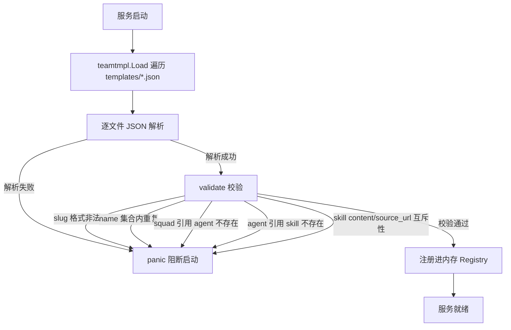
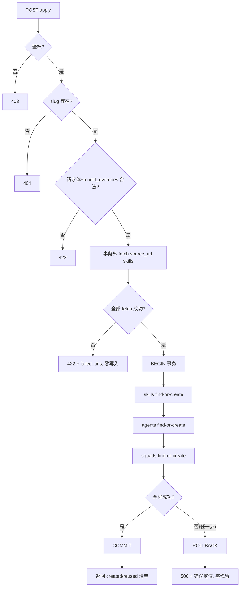

# PRD：团队模板能力（Team Template）

- 关联需求：SGD-17《团队模板能力：一键复制「1 调度官+3 小队+9 角色+1 共享 Skill」组织》
- 上游输入：SGD-18 阶段1 交付 — ba-agent《业务需求分析报告》(requirement_analysis.md) +《需求风险清单》(requirement_risk.md)
- 编写角色：pm-agent（产品经理，产品设计小队队长）
- 编写日期：2026-08-07
- 状态：**待人类主管 Gate**（未过 Gate 前禁止进入研发）

---

## 0. 文档说明（本 PRD 是全流程唯一需求标准）

本 PRD 将 ba-agent 的业务分析转写为可研发落地的唯一标准。任何需求/交互变更必须由 pm-agent 更新本 PRD 并同步全队，口头变更一律无效。研发以本 PRD + 后续 architect 的 OpenAPI 契约为准。

## 1. 产品定位（主管已确认，勿重复讨论）

- **通用机制**：任何组织形态均可打包成团队模板复用；装备部 1+3+9 是第一个模板实例。
- **范围**：后端模板引擎（`server/internal/teamtmpl`）+ 静态 JSON 模板文件（嵌入式）+ REST API（list/detail/apply）+ 首个模板 `equipment-department-1-3-9`。
- **明确不做**（首版范围外）：
  - 不做前端 UI（仅后端 API，后续再接入创建 Agent 对话框）；
  - 不做模板 DB 化 / 运行时编辑（模板走 PR 评审，与 `agenttmpl` 一致）；
  - 不做 squad 成员分角色细化（leader/member 两级即可，与 `squad_member` 数据模型对齐）。

---

## 2. 功能清单

### 2.1 模板引擎（boot 期）

| 编号 | 功能 | 说明 |
|---|---|---|
| FR-01 | 新增 `server/internal/teamtmpl` 包 | `types.go` + `loader.go`，静态 JSON 嵌入，boot 时校验失败即 panic（与 `agenttmpl` 同模式）。 |
| FR-02 | 模板结构 | `skills[]`（content 内嵌 / source_url 两种）+ `agents[]`（name/description/model/instructions/skills 按名引用）+ `squads[]`（name/description/instructions/leader/members 按 agent name 引用）。 |
| FR-03 | loader 校验规则 | slug 格式合法；name 在各自集合内唯一（大小写不敏感）；squad 引用的 agent name 必须在 `agents[]` 内存在；agent 引用的 skill name 必须在 `skills[]` 内存在；`skills[].content` 与 `source_url` 互斥且至少其一。 |

### 2.2 REST API（3 个端点）

| 编号 | 端点 | 说明 |
|---|---|---|
| FR-04 | `GET /api/team-templates` | 模板列表（只读，无副作用）。 |
| FR-05 | `GET /api/team-templates/{slug}` | 模板详情（只读，无副作用）。 |
| FR-06 | `POST /api/team-templates/{slug}/apply` | 一键应用：单事务原子创建全部 skills + agents + squads，失败整体回滚。 |

### 2.3 apply 语义

| 编号 | 功能 | 说明 |
|---|---|---|
| FR-07 | 单事务原子创建 | 全部 skills + agents + squads 在一个事务内创建，任一步失败整体回滚，零残留。 |
| FR-08 | 返回 created/reused 清单 | 每个资源独立标注 `created \| reused`，并带资源 id。 |
| FR-09 | skill find-or-create | 内嵌 content 直接建；source_url 走现有 ImportSkill fetch 链路（fetch 在事务外）。 |
| FR-10 | agent find-or-create | 按 workspace+name 幂等复用；复用 `CreateAgentFromTemplate` 的 skill 导入 + agent 创建 + 权限落库逻辑。 |
| FR-11 | squad find-or-create | 按 name 解析 leader/member 到实际 agent id；复用 `CreateSquad` / `AddSquadMember` 逻辑。 |
| FR-12 | 模型处理 | 模板默认 model + 请求级 `model_overrides`（按 agent name 覆盖）；运行时执行期不支持时由 daemon 优雅回退，apply 不强校验模型可用性。 |

### 2.4 首个模板实例

| 编号 | 功能 | 说明 |
|---|---|---|
| FR-13 | `templates/equipment-department-1-3-9.json` | 10 个 agent（pmo/ba/pm/ux/architect/dev/senior-dev/qa-reviewer/devops/security-audit）+ 3 个 squad + `multica-team-workflow` skill 全文（内嵌 content）。 |

---

## 3. User Story

| 编号 | 角色 | 故事 | 对应 FR |
|---|---|---|---|
| US-01 | 工作区管理员 | 我希望一次 apply 团队模板即可得到完整的 10 agent + 3 squad + 1 skill，不必手工逐建。 | FR-06 |
| US-02 | 工作区管理员 | 我希望看到每个资源的 created/reused 结果与 id，以便知道哪些是新建、哪些复用了存量。 | FR-08 |
| US-03 | 误操作用户 | 我希望重复 apply 不会产生重复资源，全部返回 reused。 | FR-09/10/11 |
| US-04 | 部分配置过的用户 | 我希望 apply 能复用已有同名资源并补齐缺失部分（混合结果）。 | FR-09/10/11 |
| US-05 | 模板维护者 | 我希望模板文件在服务启动时被强校验，错误模板在部署期阻断而非运行时失败。 | FR-03 |
| US-06 | apply 遇到单点失败的用户 | 我希望任一资源创建失败时整体回滚，不留下半成品组织。 | FR-07 |
| US-07 | 前端接入方（后续） | 我希望 3 个 API 有稳定、可预期的契约与错误码。 | FR-04/05/06 |
| US-08 | 使用可选模型的工作区管理员 | 我希望通过 `model_overrides` 覆盖部分 agent 的模型，且不影响其他 agent。 | FR-12 |

---

## 4. 逻辑流程图（Mermaid）

### 4.1 模板加载流程（boot 期）



### 4.2 apply 主流程时序图（含 fetch 外置与回滚路径）

```mermaid
sequenceDiagram
    autonumber
    participant C as 调用方(CLI/前端)
    participant H as Handler
    participant T as teamtmpl Registry
    participant F as Skill Fetch
    participant DB as DB(单事务)

    C->>H: POST /api/team-templates/{slug}/apply
    H->>H: 鉴权：workspace 成员? role?
    alt 无权限
        H-->>C: 403
        return
    end
    H->>T: Get(slug)
    alt slug 不存在
        H-->>C: 404
        return
    end
    H->>H: 解析请求体 + model_overrides 校验
    alt 请求体非法 / model_overrides 引用不存在 agent
        H-->>C: 400/422
        return
    end

    Note over H,F: 阶段1：事务外 fetch（规避长事务持锁, R-05）
    H->>F: 并行 fetch source_url skills（超时+重试）
    alt 任一 fetch 失败
        F-->>H: failed_urls
        H-->>C: 422 {error, failed_urls}（零写入）
        return
    end

    Note over H,DB: 阶段2：单事务内仅落库
    H->>DB: BEGIN
    DB-->>H: ok
    loop skills[]
        H->>DB: find-or-create by (workspace,name)
    end
    loop agents[]
        H->>DB: find-or-create by (workspace,name) + 挂 skill
    end
    loop squads[]
        H->>DB: find-or-create by name + 解析 leader/members → agent id
    end
    alt 任一步落库失败
        H->>DB: ROLLBACK
        DB-->>H: ok（零残留）
        H-->>C: 500 内部错误
        return
    else 全部成功
        H->>DB: COMMIT
        DB-->>H: ok
        H-->>C: 200/201 {skills[], agents[], squads[]} created/reused 清单
    end
```

### 4.3 apply 失败回滚路径（异常分支细化）



---

## 5. 异常状态处理规则（未定义状态必须覆盖）

### 5.1 幂等语义（核心契约）

- **幂等键 = workspace_id + resource_type + name**（skill/agent/squad 各自独立）。
- 大小写处理：模板 loader 内 name 按**大小写不敏感**校验唯一；apply 的 find-or-create 匹配遵循**数据库唯一约束语义**（skill/squad `UNIQUE(workspace_id,name)`，agent `agent_workspace_name_unique`，均为大小写敏感）。为保证"重复 apply 全 reused"，模板内同名（大小写不敏感）判重即可杜绝歧义；若存量资源与模板 name 仅大小写不同，按 DB 语义视为不同资源（首版接受，风险 R-01 已收敛）。
- 跨模板同名：**首版采用"同名即复用"**（无论内容是否一致），保证幂等不被破坏；内容冲突策略见 5.2。

### 5.2 find-or-create 冲突策略（R-02 收敛）

| 场景 | 策略 |
|---|---|
| 同名且内容一致 | **reused**，无告警。 |
| 同名但内容不一致（含存量资源由他处创建） | **reused + warning**（复用存量，不覆盖、不报错）。首版不做内容更新；警告随响应返回，便于排查"静默复用错误资源"（R-02 建议的三级策略中选"复用并记录 warning"，放弃"报错"与"更新内容"，理由：报错会破坏"重复 apply 全 reused"验收，更新内容有污染用户数据风险）。 |
| `model_overrides` 引用模板外 agent name | **422 校验失败**，整体拒绝，不进入事务。 |

### 5.3 异常场景清单

| 编号 | 场景 | HTTP | 行为 |
|---|---|---|---|
| EX-01 | 重复 apply（同 slug 同 workspace） | 200/201 | 全部 reused，无重复资源。 |
| EX-02 | skill source_url fetch 失败（超时/404/鉴权） | 422 | 返回 `{error, failed_urls}`，零写入（fetch 在事务外，无回滚负担）；错误可定位到具体 skill 与 URL。 |
| EX-03 | 事务内任一落库失败 | 500 | 整体 ROLLBACK，零残留；错误信息含失败资源定位。 |
| EX-04 | 模型不支持（模板默认或 overrides） | —（apply 不失败） | apply 成功；运行时由 daemon 优雅回退（与现有 `handler/agent.go` 弱校验一致），PRD 明确 apply 阶段不预检模型可用性。 |
| EX-05 | squad 引用缺失 agent | —（boot 期阻断） | loader 校验失败即 panic，运行时不可能出现；防线前移到 boot。 |
| EX-06 | slug 不存在 | 404 | 明确错误。 |
| EX-07 | 权限不足（非 workspace 成员/角色无权 apply） | 403 | 禁止创建。 |
| EX-08 | 并发重复 apply（同 workspace 同时两个请求） | — | 依赖 `(workspace_id,name)` 唯一约束兜底 find-or-create 竞态窗口（R-03）；并发场景必须入测试。 |
| EX-09 | source_url skill 已存在（同名） | 200/201 | find-or-create 复用，不重复 fetch/创建（与 EX-01 同幂等键）。 |
| EX-10 | 模板 JSON 结构非法（缺字段/类型错/slug 与文件名不符） | —（boot 期） | panic；校验错误聚合输出（一次报全部问题，R-06）。 |
| EX-11 | workspace 资源数量上限 | — | 首版不引入新配额逻辑；若触及平台既有上限导致创建失败，走事务回滚路径（与 EX-03 一致），不部分提交。 |
| EX-12 | apply 混合结果（部分 reused + 部分 created） | 200/201 | **允许**，属正常态；仅当发生错误才整体回滚，不存在"部分提交"。 |
| EX-13 | 事务提交失败（COMMIT 阶段） | 500 | 依赖 DB 事务语义，视为整体失败，无残留。 |

### 5.4 响应结构约定

- apply 成功响应（建议契约，最终以 architect OpenAPI 为准）：
  ```json
  {
    "skills":  [{"name": "multica-team-workflow", "id": "<uuid>", "status": "created|reused", "warning": "<可选>"}],
    "agents":  [{"name": "pmo-agent", "id": "<uuid>", "status": "created|reused", "warning": "<可选>"}],
    "squads":  [{"name": "squad-product-design", "id": "<uuid>", "status": "created|reused", "warning": "<可选>"}]
  }
  ```
- 错误结构对齐现有规范：`{"error": "<message>"}`（与 `writeError` 一致）；fetch 失败对齐 `agent_template.go` 的 `fetchFailureResponse`（`{"error","failed_urls"}`）。
- 空值语义：列表字段缺失/空 → `[]`（非 null），由 architect 在 OpenAPI 中定稿。

---

## 6. 验收标准（与研发对齐的契约）

1. **3 个 API 可用**：`GET /api/team-templates`、`GET /api/team-templates/{slug}`、`POST /api/team-templates/{slug}/apply`。
2. **一键 apply 成功**：apply 后 workspace 出现 10 个 agent + 3 个 squad + 1 个 skill，全部带完整 prompt/instructions。
3. **apply 幂等**：重复 apply 返回全 reused，不产生重复资源（用 multica CLI 实测）。
4. **单事务原子性**：注入坏 skill URL → 全量回滚，零残留（无半套组织）。
5. **loader 校验**：slug 格式、name 唯一、squad 引用 agent 存在性、agent 引用 skill 存在性、skill content/source_url 互斥。
6. **skill 两分支**：内嵌 content 与 source_url 均可用。
7. **并发测试**：并发重复 apply 不产生重复资源（唯一约束兜底验证）。
8. **测试全绿**：`make test`（Go）通过，含新增 teamtmpl/apply 用例。
9. **PR 合入 `origin/Equipment_Department_Exploration`**（本地部署源），本地 :3000/:8080 实例验证 API 可访问。

---

## 7. 待 PRD 明确问题的收敛（回应 ba-agent 5 项）

| # | 问题 | 决策 |
|---|---|---|
| 1 | find-or-create 同名不同内容策略 | **复用 + warning**（不覆盖、不报错），见 §5.2。 |
| 2 | apply 混合结果是否允许 | **允许**（部分 reused + 部分 created 是正常态），仅错误时整体回滚，见 EX-12。 |
| 3 | `model_overrides` 覆盖粒度与校验 | **按 agent name 的 map**（`{"<agentName>": "<model>"}`），仅可覆盖模板内存在的 agent；引用不存在 → 422；模型可用性不预检（FR-12）。 |
| 4 | workspace 资源上限兜底 | **首版不引入新配额**；触限失败走统一回滚路径（EX-11）。 |
| 5 | 错误响应结构 | **对齐现有 `{"error": msg}` 规范**，fetch 失败复用 `failed_urls` 结构，见 §5.4。 |

---

## 8. 风险对照（承接 requirement_risk.md）

| 风险 | 等级 | 本 PRD 的收敛 |
|---|---|---|
| R-01 幂等键语义 | 🔴 | §5.1 明确：workspace_id + resource_type + name；模板内大小写不敏感判重，跨模板同名复用。 |
| R-02 find-or-create 冲突 | 🔴 | §5.2 决策：复用 + warning。 |
| R-03 并发竞态 | 🔴 | §5.3 EX-08 + 验收 §6.7：唯一约束兜底 + 并发测试。 |
| R-04 fetch 失败全量回滚 | 🔴 | §4.2 阶段1：**fetch 在事务外**，失败 422 零写入；建议 fetch 超时+重试；模板维护优先内嵌 content。 |
| R-05 事务内网络 fetch 锁时长 | 🟡 | §4.2：事务外 fetch → 事务内仅落库。 |
| R-06 boot panic 暴露面 | 🟡 | §5.3 EX-10：校验错误聚合输出。 |
| R-07 模型仅运行时回退 | 🟡 | §5.3 EX-04：apply 不预检，响应契约明确。 |
| R-08 错误码对齐 | 🟢 | §5.4：404/403/400/422/500 + 空值语义。 |
| R-09 复用逻辑回归 | 🟢 | 复用走"调用/组合"而非复制改写；`make test` 全绿为 Gate。 |

---

## 9. 原型说明

本需求为**纯后端 API**，交互面仅 REST 契约（§5.4），前端 UI 明确不做。**原型非必须**；如需，ux-agent 可出 API 交互示意（curl/响应示例），不产 HTML 原型。
