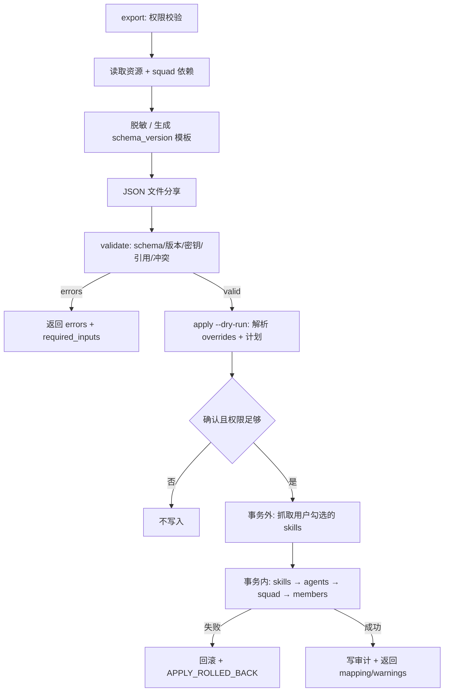

# Agent / Squad 模板能力：Schema 与 API 设计

Issue: CLO-245（PRD 已获主管 Approve，附件 `template-capability-prd.md`）
作者: architect-agent
状态: 设计定稿，作为 senior-dev-agent / qa-reviewer-agent 的实现契约

一期目标：把个人验证有效的 agent / squad 配置导出为**可移植 JSON 文件**，他人载入后
微调生成自己的副本。不建 DB 模板市场，不做 Web UI，CLI 为主交互。

## 1. 落点与现状约束

| 关注点 | 现状 | 本设计的处置 |
| --- | --- | --- |
| 官方只读模板 | `server/internal/agenttmpl/`（embed JSON） + `handler/agent_template.go:162` `CreateAgentFromTemplate` | **不改动**。新能力是独立的用户模板通道，只复用其 skill 物化子流程（预去重 → find-or-create → 同事务绑定） |
| agent 创建 | `handler/agent.go:994` `CreateAgent` | apply 走内部复用函数，不经 HTTP 自调用 |
| squad 创建 | `handler/squad.go:225` `CreateSquad` + `AddSquadMember` | 同上；leader 必须同时是 role=`leader` 成员（现有行为） |
| 唯一约束 | `agent` UNIQUE(workspace_id, name)（`046_agent_unique_name`）、`squad` UNIQUE(workspace_id, name)（`084_squad.up.sql`） | 冲突策略必须在 apply 前显式判定，不能靠 DB 报错兜底 |
| squad_member | `084_squad.up.sql:17-25`，`member_type` ∈ {agent, member} + `role` | 模板只承载 `member_type=agent`；`member` 类成员是工作区人员，不可移植，导出时降级为 warning |

### 1.1 不可移植字段（硬性）

这些字段是机器本地或工作区本地的，**禁止**写入模板文件，apply 时由调用方重新提供：

- `runtime_id`、`runtime_mode`、`runtime_config` — 机器本地。apply 必须显式传 `runtime_id`。
- `custom_env` 的**值** — 密钥。只导出 key 清单 + `required` 标记。
- `mcp_config` 中的 `auth` / `token` / `headers` / `env` 值 — 密钥。
- `invocation_targets` 中的 `member` 目标（工作区用户 UUID）— 不可移植，导出降级为 warning。
- `composio_toolkit_allowlist` — 属于 agent owner 的集成足迹，一期不导出。
- `avatar_url`、`owner_id`、`creator_id`、`archived_*`、时间戳、各类 ID。

## 2. 模板数据契约

新包 `server/internal/resourcetmpl/`（与只读的 `agenttmpl` 并列，互不依赖）：

```
resourcetmpl/
  types.go      # Template / AgentSpec / SquadSpec 及 JSON tag
  version.go    # SchemaVersion 常量 + 兼容判定
  validate.go   # 结构 / 枚举 / 未知字段 / 引用完整性校验
  redact.go     # 密钥探测与脱敏，导入侧也复用（拒绝明文）
  *_test.go
```

### 2.1 顶层结构

```jsonc
{
  "schema_version": "1.0",              // 必填，major 不匹配直接拒绝
  "template_id": "<uuid>",              // 导出时生成，仅作幂等/追溯标识
  "kind": "agent" | "squad",            // 一期不做 bundle
  "metadata": {
    "name": "…", "description": "…",
    "author": { "id": "<uuid>", "display_name": "…" },
    "version": "1.0.0",                 // SemVer
    "visibility": "workspace",          // 一期只允许该值
    "tags": ["…"],
    "source_workspace": "<uuid>",       // 仅展示，绝不作为导入授权依据
    "created_at": "<RFC3339>"
  },
  "spec": { "agent": { … } }            // 或 "squad": { … }，按 kind 二选一
}
```

`kind` 与 `spec` 的键必须一致；出现另一个键或未知顶层键 → `TEMPLATE_INVALID`。

### 2.2 AgentSpec

```jsonc
{
  "name": "…",
  "description": "…",
  "instructions": "…",
  "model": "claude-opus-5",             // 可空 = 目标 runtime 默认
  "thinking_level": "", "service_tier": "",
  "max_concurrent_tasks": 6,
  "permission_mode": "private" | "public_to",
  "public_to_workspace": false,          // public_to 时是否放开整个工作区
  "custom_args": ["…"],
  "skills": [
    { "name": "multica-squads", "source_url": "https://…", "enabled": true }
  ],
  "custom_env_keys": [
    { "key": "API_KEY", "required": true, "description": "…" }
  ],
  "mcp_servers": [
    { "name": "…", "transport": "stdio", "requires_auth": true,
      "config_skeleton": { "command": "…", "args": ["…"] } }
  ]
}
```

要点：

- `skills[].source_url` 是唯一可自动物化的字段，复用现有 skill importer 支持的
  URL 家族；无 `source_url` 的本地 skill 只按 `name` 在目标工作区找同名，找不到
  进 `required_inputs.missing_skills`，**不自动执行任何不受信任脚本**。
- `custom_env_keys` 只有 key + 是否必填。apply 时缺必填 key → 报 `required_inputs`，
  调用方通过 `agent env` 的安全通道补齐，不走命令行明文。
- `permission_mode` 只表达"私有 / 放开工作区"两档。`public_to` + `public_to_workspace=false`
  在目标环境等价于私有（原 allow-list 无法移植），validate 输出 warning。
- `thinking_level` / `service_tier` 是 runtime-native token：apply 时按目标 runtime
  用现有 `agent.IsKnownThinkingValue` / `IsKnownServiceTier` 重校验，不认识就报错并
  提示置空，不静默丢弃。

### 2.3 SquadSpec

```jsonc
{
  "name": "…", "description": "…", "instructions": "…",
  "members_mode": "embedded" | "references",
  "leader_ref": "architect-agent",
  "members": [
    { "ref": "architect-agent", "role": "leader", "agent": { …AgentSpec… } },
    { "ref": "senior-dev",      "role": "core-dev", "agent": { … } }
  ]
}
```

- `ref` 是**模板内部符号**（非 UUID），用于把 `leader_ref` 与 `members[].ref` 关联。
- `embedded`：每个成员内嵌完整 AgentSpec，apply 时按依赖顺序先建 agent 再建 squad。
- `references`：`members[].agent` 省略，apply 时按 `ref`（视作目标工作区 agent 名称）
  解析已存在且调用者有权 wire 的 agent；解析不到 → `DEPENDENCY_NOT_FOUND` + 缺失清单。
- `leader_ref` 必须命中一个成员，且该成员 `role` 必须是 `leader`，与现有
  `CreateSquad` 自动补 leader 成员的行为对齐。
- `member_type=member`（人）不进模板，导出时产生 warning。

## 3. 数据库

**一期不新增任何表、不新增迁移。** 模板是文件，不落库。

唯一的持久化需求是 apply 幂等。方案：复用现有 `activity_log` 审计写入承载
`template_id + version + idempotency_key + created_ids`，apply 入口先按
`(workspace_id, idempotency_key)` 查最近一条成功记录并直接回放结果。
理由：无 DB 模板目录是主管已确认的决策①，为一张纯幂等表引入迁移不划算；
`activity_log` 已是 apply 必须写的审计对象，一次写入两个用途。

> 若实现中发现 `activity_log` 查询无法按 idempotency_key 高效命中，允许新增
> 一张 `template_apply_log`（workspace_id, idempotency_key, template_id,
> version, result JSONB, created_at，UNIQUE(workspace_id, idempotency_key)）。
> 遵守仓库规则：**不加外键**，索引单独一个 migration 文件用
> `CREATE UNIQUE INDEX CONCURRENTLY`。

## 4. API 契约

新文件 `server/internal/handler/resource_template.go`，路由注册在
`server/cmd/server/router.go` 现有 `/api/agent-templates` 块之后：

```go
r.Route("/api/templates", func(r chi.Router) {
    r.Post("/export",   h.ExportResourceTemplate)
    r.Post("/validate", h.ValidateResourceTemplate)
    r.Post("/apply",    h.ApplyResourceTemplate)
})
```

三个端点都要求工作区成员身份（`h.requireWorkspaceMember`），拒绝 agent-actor
token 读取密钥相关字段（沿用 `agent_env.go` 的 actor 判定）。

### 4.1 `POST /api/templates/export`

```jsonc
// req
{ "kind": "agent|squad", "resource_id": "<uuid|name>",
  "members_mode": "embedded|references",   // squad only，默认 embedded
  "metadata": { "version": "1.0.0", "tags": ["…"], "description": "…" } }

// 200
{ "template": { …完整模板… },
  "warnings": [ { "code": "MEMBER_HUMAN_DROPPED", "message": "…", "path": "spec.squad.members[2]" } ] }
```

权限：调用者必须能读该资源（agent 走 `loadAgentForUser` 语义 + owner/admin 判定；
squad 还必须能读 leader 与**全部**成员 agent）。任一依赖不可读 → `403 FORBIDDEN`
并列出缺失依赖，**不产出部分模板**。

### 4.2 `POST /api/templates/validate`

```jsonc
// req
{ "template": { … }, "target_runtime_id": "<uuid>", "members_mode": "…" }
// target_runtime_id 必填（Q3）：runtime 是 model / thinking_level / service_tier 重校验前提

// 200（校验失败也是 200，用 errors 承载；只有请求体本身坏了才 4xx）
{ "valid": false,
  "errors":   [ { "code": "TEMPLATE_INVALID", "path": "spec.agent.name", "message": "…" } ],
  "warnings": [ … ],
  "required_inputs": {
    "env_keys":       [ { "agent_ref": "architect-agent", "key": "API_KEY" } ],
    "missing_skills": [ { "name": "…", "source_url": "…", "installable": true } ],
    "mcp_servers":    [ { "agent_ref": "…", "name": "…" } ],
    "missing_agents": [ { "ref": "…", "name": "…" } ]   // references 模式引用缺失（Q7）
  },
  "plan": { "agents_to_create": ["…"], "squads_to_create": ["…"],
            "conflicts": [ { "kind": "agent", "name": "…", "existing_id": "<uuid>" } ] } }
```

`installable=true` 表示有可用 `source_url`，用户可选择安装（决策③：不自动装）。

### 4.3 `POST /api/templates/apply`

```jsonc
// req
{ "template": { … },
  "target_runtime_id": "<uuid>",          // 必填
  "members_mode": "embedded|references",
  "overrides": {
    "name": "我的架构师", "description": "…", "instructions": "…",
    "model": "…", "permission_mode": "private",
    "agents": { "senior-dev": { "name": "…", "instructions": "…" } }  // 按 ref 覆盖
  },
  "env": { "architect-agent": { "API_KEY": "…" } },  // 仅走 POST body，不进命令行
  "install_missing_skills": ["<source_url>"],        // 用户显式勾选的安装清单
  "conflict_policy": "fail|rename|skip",             // 默认 fail；禁止 overwrite
  "idempotency_key": "<caller-generated>",
  "dry_run": false }

// 200
{ "applied": true, "dry_run": false,
  "created": { "agents": [ { "ref": "…", "id": "<uuid>", "name": "…" } ],
               "squads": [ { "id": "<uuid>", "name": "…" } ],
               "skills": [ { "id": "<uuid>", "name": "…", "reused": true } ] },
  "resource_mapping": { "architect-agent": "<uuid>" },
  "skipped": [ … ], "warnings": [ … ],
  "rolled_back": false, "idempotent_replay": false }
```

- `dry_run=true` 返回同结构但 `created` 为计划、绝不写库。
- 创建后资源归属当前操作者（`owner_id` = caller），`permission_mode` 默认 `private`
  —— 决策④"不立即激活接收任务"在一期由 private + 不建 autopilot 达成，不新增
  agent 状态字段。
- 原子性：agents + skill 绑定 + squad + squad_member 在**同一个 pgx 事务**内完成
  （skill 的**网络抓取在事务外先做完**，只把内存结果带进事务，复刻
  `CreateAgentFromTemplate` 现有分层）。任一步失败 → 事务回滚，返回
  `APPLY_ROLLED_BACK` + 失败依赖，`rolled_back: true`，不留孤儿。
- 重复 `idempotency_key` → 回放首次结果，`idempotent_replay: true`，不重复创建。

### 4.4 错误码（稳定契约，前端与 CLI 都依赖）

| code | HTTP | 触发 |
| --- | --- | --- |
| `TEMPLATE_INVALID` | 200(errors) / 400 | JSON 坏、字段缺失、未知字段 |
| `TEMPLATE_VERSION_UNSUPPORTED` | 200(errors) | schema_version major 不匹配 |
| `FORBIDDEN` | 403 | 越权导出/创建；不泄露资源存在性 |
| `SECRET_DETECTED` | 400 | 模板含明文密钥（导出与导入双侧拒绝） |
| `CONFIG_NOT_ALLOWED` | 400 | permission/mcp/runtime 配置未过目标 allowlist |
| `DEPENDENCY_NOT_FOUND` | 200(errors) | references 模式引用不到 agent / 依赖已归档 |
| `NAME_CONFLICT` | 200(plan.conflicts) / 409 | 同名且策略 fail |
| `APPLY_ROLLED_BACK` | 500 | 事务内失败已回滚 |
| `QUOTA_EXCEEDED` | 409 | 目标限额不足 |
| `REQUIRED_INPUT_MISSING` | 200(errors) | `required: true` 的 env key 未在 apply 提供 |
| `RUNTIME_NOT_FOUND` | 200(errors) / 404 | `target_runtime_id` 不存在或调用者无权访问 |
| `RETRYABLE` | 502 / 503 / 504 | 上游超时或 5xx，结果不确定，须用同一 `idempotency_key` 重试 |
| `CANCELLED` | 499 | 客户端断开；服务端事务继续收敛，用同 key 查询最终态 |

本表是错误码的唯一权威来源。PRD §6.1 与 §9 两张表在合并前存在状态码缺口（`RETRYABLE` / `CANCELLED` 无 HTTP 状态、`RUNTIME_NOT_FOUND` 未映射），已在此闭合，实现与测试都以本表为准。

`200(errors)` 表示 validate / dry-run 语义下的"请求本身合法、内容校验失败"，响应体 `errors[]` 携带 code + JSON path；同一 code 出现在真正写入路径时使用其后备 HTTP 状态。

### 4.5 契约裁定（回应 CLO-252 Q1–Q12）

以下裁定为实现与测试断言的权威口径，编码前生效。

| # | 裁定 |
| --- | --- |
| Q1 | `schema_version` 只比 major。major 相同即接受，未知**顶层**字段拒绝（`TEMPLATE_INVALID`），未知**嵌套**字段忽略并计入 `warnings`。不做兼容矩阵。 |
| Q2 | 见 §4.4 合并后的单表，已补全三个缺口码。 |
| Q3 | `target_runtime_id` 在 validate 与 apply **均必填**；缺失或不可访问 → `RUNTIME_NOT_FOUND`。runtime 是 `model` / `thinking_level` / `service_tier` 重校验的前提，validate 少了它就无法给出可信 dry-run。 |
| Q4 | 权限在 **validate 阶段**全量校验（创建 agent/squad、绑定 skill、设置 permission_mode / invocation_target），dry-run 因此可信。apply 重跑同一套校验（TOCTOU 防护），额外只做 `idempotency_key` 回放判定。 |
| Q5 | `rename` 后缀 = `"<name>-" + 短 UUID 前 8 位小写十六进制`，例：`架构师-3f9a1c04`。不用序号（并发下需额外锁且不幂等）。映射写入结果 `resource_mapping`。 |
| Q6 | secret 检测三条并行规则：① key 名大小写不敏感黑名单（`token` / `secret` / `password` / `passwd` / `api_key` / `apikey` / `private_key` / `credential` / `auth` 子串匹配）且值长度 ≥ 8；② 值匹配 `Authorization` 头结构（`Bearer|Basic|Token` + 空格 + ≥ 8 位）按结构判定，不做字符串包含匹配；③ 已知前缀字面量（`sk-` / `ghp_` / `gho_` / `xoxb-` 等）。不做熵值判定——误报率高且不可测。命中即 `SECRET_DETECTED`，导出与导入双侧拒绝，绝不静默清洗。 |
| Q7 | `references` 模式引用缺失：validate 响应 `errors[]` 置 `DEPENDENCY_NOT_FOUND`，同时 `required_inputs.missing_agents[]` 列出 `{ref, name}`。前者决定能否 apply，后者供 UI/CLI 渲染补齐清单。 |
| Q8 | `overrides.agents[<ref>]` 的 `ref` 是**导出时生成的模板内符号**（slug 化的 agent 名，模板内唯一，非 UUID）。apply 在 plan 阶段建立 `ref → 新建资源 ID` 映射并回写 `resource_mapping`；`squad.leader.agent_ref` / `members[].agent_ref` 走同一张表。 |
| Q9 | `kind: "bundle"` 一期**拒绝**，code 复用 `TEMPLATE_INVALID`，message 明示"bundle 一期不支持"。不新增 `BUNDLE_NOT_SUPPORTED`——错误码是稳定契约，为一期就不实现的形态占位会留下永久死码。 |
| Q10 | apply 的 `env` 结构 = `{ "<agent_ref>": { "KEY": "value" } }`，按 Q8 的符号 ref 索引。`kind: agent` 模板同样用 ref 一层包裹，保持单一形状。 |
| Q11 | `install_missing_skills` 元素只接受 `source_url` 字符串，必须是模板 `spec` 内已出现的 URL 子集；服务端**不**做 name → URL 解析，避免把"名字像"变成任意 URL 拉取。 |
| Q12 | apply 未提供 `required: true` 的 env key → validate 阶段 `REQUIRED_INPUT_MISSING`（携带 `agent_ref` + key 名，**不带值**），不进入写入路径。可选 key 缺失只进 `warnings`。 |

## 5. CLI 契约

新文件 `server/cmd/multica/cmd_template.go`，`main.go` 注册 `templateCmd`。

```bash
multica template export --kind agent --id <agent> --output agent.json
multica template export --kind squad --id <squad> --members-mode embedded -o squad.json
multica template validate --file squad.json --runtime-id <rt> [--output json]
multica template apply --file squad.json --runtime-id <rt> --dry-run
multica template apply --file squad.json --runtime-id <rt> \
    --conflict-policy rename --set name="我的团队" --set agents.senior-dev.name="小李" \
    --env-file ./env.json --install-missing-skills --yes
```

规则：

- `--id` 走现有 `resolveAgent` / squad 解析，支持名称或 UUID。
- 密钥只接受 `--env-file`（建议 0600）或 `--env-stdin`，**没有** `--env` 明文 flag
  —— 比 `agent create` 更严，因为模板场景天然会被贴进聊天记录。
- 非交互执行必须 `--yes`；否则 apply 先打印 dry-run 计划再确认。
- `--output json` 输出与 API 同构的稳定机器格式；默认 table/人类可读。
- 退出码：0 成功；1 一般错误；2 校验失败（errors 非空）；3 冲突需决策。

## 6. 流程



## 7. 子 Task 拆解

| Stage | Task | 负责 |
| --- | --- | --- |
| 1 | T1 `resourcetmpl` 包：types / version / validate / redact + 单测 | senior-dev-agent |
| 2 | T2 export 端点 + 权限与脱敏 | senior-dev-agent |
| 2 | T3 validate + apply 端点（事务、冲突、幂等、回滚） | senior-dev-agent |
| 3 | T4 CLI `multica template` 三子命令 + 命令测试 | senior-dev-agent |
| 4 | T5 集成测试与质量审查（越权/密钥/回滚/幂等/超时） | qa-reviewer-agent |
| 5 | T6 文档（schema、脱敏、凭据注入、CLI 示例、兼容策略）+ 特性分支本地部署验收 | senior-dev-agent |

T1 是所有后续任务的类型基础，必须先落地。T2/T3 可并行（同 stage）。
T4 依赖 T2+T3 的端点契约。T5 在功能完成后统一验收。T6 最后收口并交付演示环境。

## 8. 实现约束（回归仓库规则）

- 特性分支开发 + PR，**禁止**直推 main；PR 标题带 `CLO-245`。
- Go：`gofmt` / `go vet` / 错误必查；注释英文。
- handler 内 UUID 来源必须明确：路径参数走 loader，请求体纯 UUID 走
  `parseUUIDOrBadRequest`。
- 不加 DB 外键；若最终新增索引，单独 migration + `CONCURRENTLY`。
- 不做兼容层 / 双写 / 临时 shim（`agenttmpl` 保持原样，不改造）。
- 若改动了 CLI 命令或 API 字段，同 PR 更新
  `server/internal/service/builtin_skills/*` 下相关 `SKILL.md` 与 source map。
- 一期不写前端，但 API 返回体保持 UI 无关（errors / warnings / required_inputs /
  resource_mapping / plan），供后续接 `TemplateChooser` 扩展。

